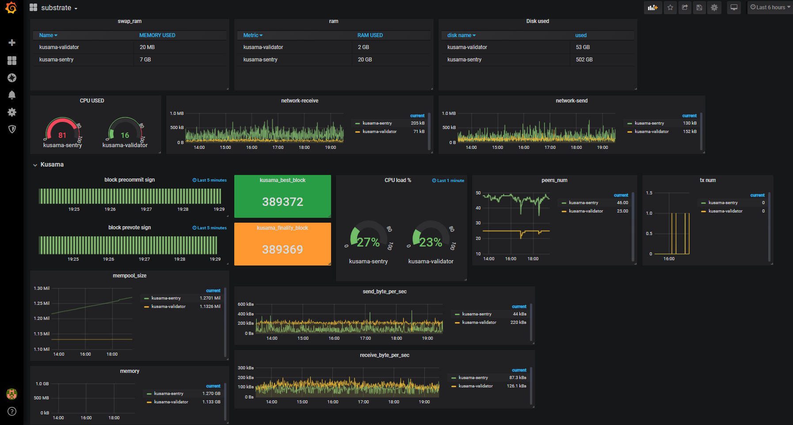

# Substrate Prometheus Node Exporter

## Introduction

Prometheus is one of the most widely used monitoring tool for managing high availability services supported by [Cloud Native Computing Foundation](https://www.cncf.io/). By providing Prometheus metrics in Substrate, node operators can easily adopt widely used display/alert tools such as Grafana and Alertmanager without setting-up/operating external Prometheus push gateways (which is an antipattern in the first place) through RPC connections. Easy access to such monitoring tools will benefit parachain developers/operators and validators to have much higher availability of their services.

## Table of Contents

Metrics
 - List of available metrics

Start Prometheus
 - Install prometheus
 - Edit Prometheus config file
 - Start Prometheus

Start Grafana
 - Install Grafana

## Metrics

substrate can report and serve the Prometheus metrics, which in their turn can be consumed by Prometheus collector(s).

This functionality is disabled by default.

To enable the Prometheus metrics, set in your cli command (--prometheus-addr,--prometheus-port ). 
Metrics will be served under /metrics on 9955 port by default.

### List of available metrics


Consensus metrics, namespace: `substrate`

| **Name**                               | **Type**  | **Tags** | **Description**                                                 |
| -------------------------------------- | --------- | -------- | --------------------------------------------------------------- |
| consensus_finality_block_height_number | IntGauge  |          | finality Height of the chain                                    |
| consensus_best_block_height_number     | IntGauge  |          | best Height of the chain                                        |
| consensus_target_syn_number            | IntGauge  |          | syning Height target number                                     |
| consensus_num_txs                      | Gauge     |          | Number of transactions                                          |
| consensus_node_memory                  | IntGauge  |          | Node's primary memory                                           |
| consensus_node_cpu                     | IntGauge  |          | Node's cpu load                                                 |
| consensus_state_cache_size             | IntGauge  |          | used state cache size                             			  |
| p2p_peers_number                       | IntGauge  |          | Number of peers node's connected to                             |
| p2p_peer_receive_bytes_per_sec         | IntGauge  |          | number of bytes received from a given peer                      |
| p2p_peer_send_bytes_per_sec            | IntGauge  |          | number of bytes sent to a given peer                            |
| mempool_size                           | IntGauge  |          | Number of uncommitted transactions                              |
| Resource_receive_bytes_per_sec | IntGauge  |          | Operating System of bytes received                              |
| Resource_send_bytes_per_sec    | IntGauge  |          | Operating System of bytes sent                                  |
| Resource_cpu_use              | IntGauge  |          | Operating System cpu load                                       |
| Resource_disk_use             | IntGauge  |          | Operating System disk use                                      |
| Resource_memory_use            | IntGauge  |          | Operating System memory use                                      |
| Resource_swap_use              | IntGauge  |          | Operating System swap memory use                                      |
| validator_sign_prevote        | IntGauge  | validator addr | validator sign vote list                               	  |
| validator_sign_precommit      | IntGauge  | validator addr | validator sign commit list                                |                       |


## Start Prometheus
### Install prometheus

https://prometheus.io/download/
```bash
wget <download URL>
tar -zxvf <prometheus tar file>
```

### Edit Prometheus config file

You can visit [prometheus.yml](https://github.com/prometheus/prometheus/blob/master/documentation/examples/prometheus.yml) to download default `prometheus.yml`.

Then edit `prometheus.yml` and add `jobs` :

```yaml
      - job_name: kusama
          static_configs:
          - targets: ['localhost:9955']
            labels:
              instance: local-validator
```

> Note：value of targets is ip:port which used by substrate monitor 

### Start Prometheus

```bash
cd <prometheus file>
./prometheus
```

> The above example, you can save `prometheus.yml` at `~/volumes/prometheus` on your host machine

You can visit `http://localhost:9090` to see prometheus data.


## Start Grafana
### Install Grafana
https://grafana.com/docs/installation/debian/

```bash
apt-get install -y software-properties-common
sudo add-apt-repository "deb https://packages.grafana.com/oss/deb stable main"
wget -q -O - https://packages.grafana.com/gpg.key | sudo apt-key add -
sudo apt-get update
sudo apt-get install grafana
sudo service grafana-server start
./prometheus
```

You can visit `http://localhost:3000/` to open grafana and create your own dashboard.

> Tips: The default username and password are both admin. We strongly recommend immediately changing your username & password after login

### Seting Grafana

Default ID:PW is admin.

Samples(dashboard-export.json import), Prometheus Node IPs must be set directly from the panel.

ex)
